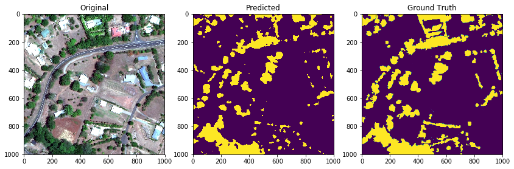

# Satellite Tree Segmentation for Wildfire Prevention

[](https://python.org)
[](https://keras.io)
[](https://tensorflow.org)
[](LICENSE)

**Deep learning on satellite imagery** | Tree detection near power lines | Wildfire risk prevention

---

## 🔥 What is this?

This repository contains my work on **satellite image segmentation** to identify trees that pose wildfire risks near power infrastructure.



I built, trained, and evaluated deep learning models (including **Deep Residual U‑Net**) as part of a collaborative project with **Omdena** and **Spacept**. [Omdena](https://www.omdena.com/projects/ai-prevent-forest-fires)

---

## 🎯 My role

| Task | What I did |
|------|-------------|
| **Model architecture** | Implemented Deep Residual U‑Net and baseline models |
| **Training** | Trained models on satellite imagery |
| **Evaluation** | Tested performance and compared architectures |
| **Code** | All notebooks in this repository are my own |

> *This was a team project. The data and final integration involved others. My contribution was model development and training.*

---

## 📂 Repository files

| File | Description |
|------|-------------|
| `Deep_Residual_Unet.ipynb` | Deep Residual U‑Net architecture (main model) |
| `New_model3.ipynb` | Alternative model exploration and training |
| `requirements.txt` | Python dependencies |
| `LICENSE` | MIT license |


## 🚀 How to run my code

```bash
# Clone
git clone https://github.com/your-username/your-repo-name.git
cd your-repo-name

# Install
pip install -r requirements.txt

# Open notebooks
jupyter notebook Deep_Residual_Unet.ipynb
